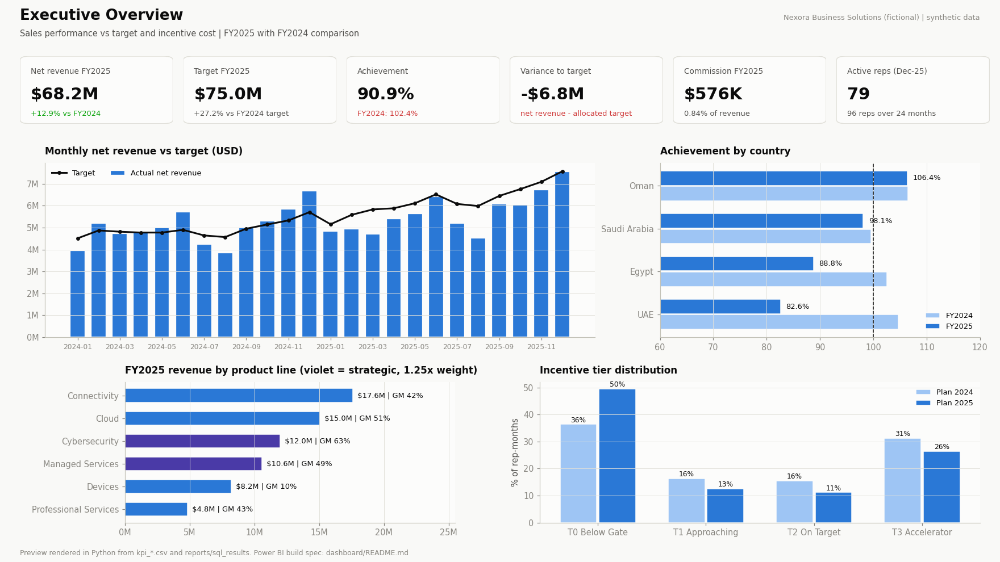
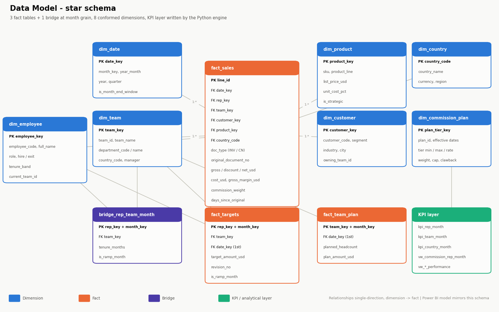
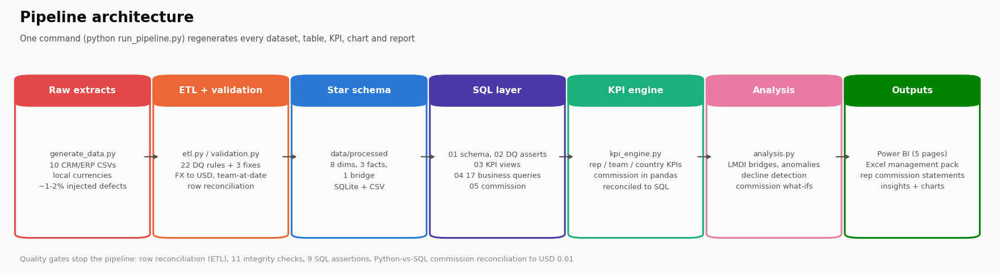
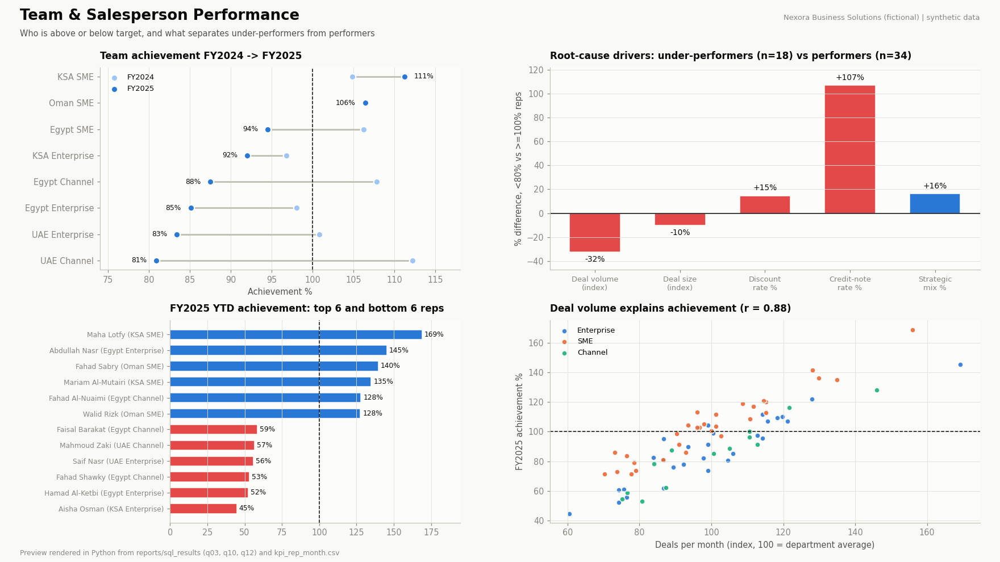
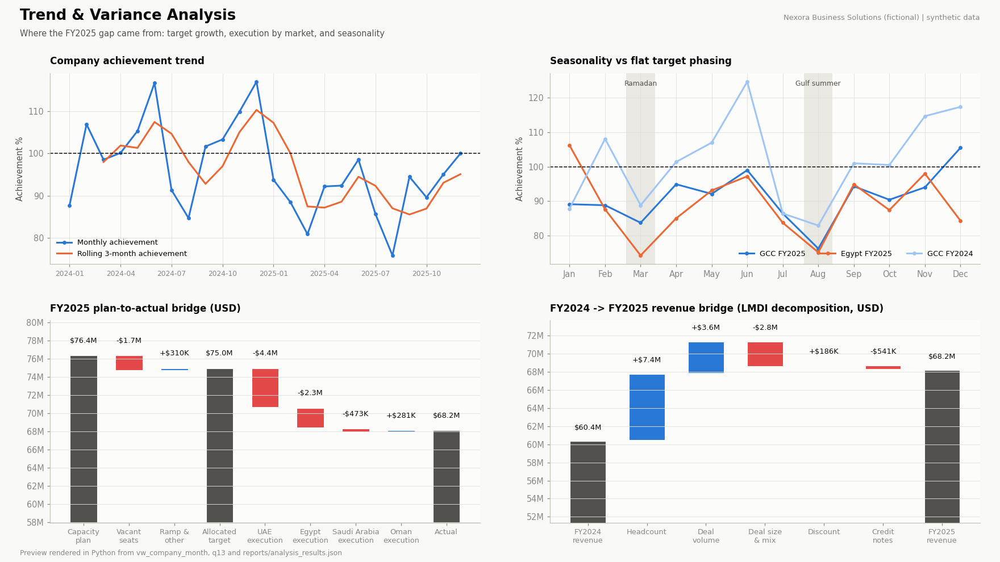
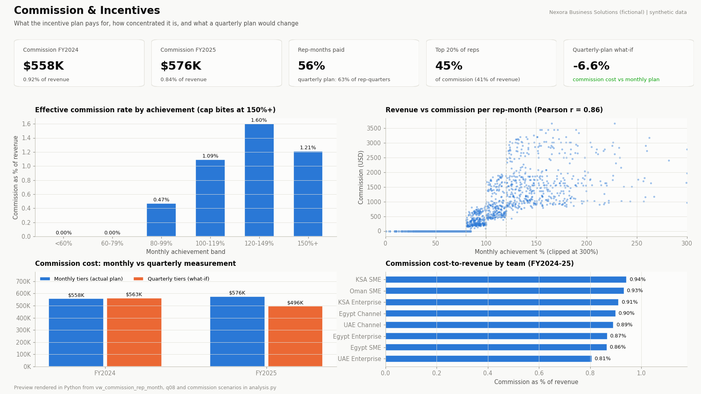

# Sales Performance & Commission Analytics

**End-to-end analytics for a multi-country B2B sales organization: from raw CRM/ERP extracts to a validated star schema, a
SQL KPI layer, a versioned commission engine, root-cause analysis and an executive Power BI dashboard.**


> **Portfolio project on synthetic data.** *Nexora Business Solutions* is a fictional company. No real customer,
> employee or employer data is used anywhere in this repository.



**In 30 seconds:**
* **96 sales reps · 8 teams · 3 departments · 4 countries (Egypt, KSA, UAE, Oman) · 24 months · 31.5K invoice lines**
* One command, `python run_pipeline.py`, regenerates everything:
  * data generation → ETL with 22 data-quality rules → SQLite star schema
  * 17 business-question SQL queries
  * KPI and commission engine, reconciled Python ↔ SQL to the cent
  * variance decomposition and anomaly detection
  * charts, an Excel management pack and 79 rep commission statements
* The headline finding: **FY2025 achievement fell to 90.9%, but revenue grew +12.9%.** Targets grew +27.2%. Two markets
  explain 97% of the execution gap, and a quarterly incentive design would cost 6.6% less while paying more reps.

---

## Table of Contents
1. [Business Problem](#1-business-problem) · 2. [Objective](#2-project-objective) · 3. [Business Questions](#3-business-questions) ·
4. [Dataset](#4-dataset) · 5. [Data Model](#5-data-model) · 6. [Data Pipeline](#6-data-pipeline) · 7. [Technologies](#7-technologies) ·
8. [KPI Definitions](#8-kpi-definitions) · 9. [SQL Analysis](#9-sql-analysis) · 10. [Python Analysis](#10-python-analysis) ·
11. [Dashboard](#11-dashboard) · 12. [Key Insights](#12-key-insights) · 13. [Recommendations](#13-business-recommendations) ·
14. [Data Quality](#14-data-quality) · 15. [Repository Structure](#15-repository-structure) · 16. [How to Run](#16-how-to-run) ·
17. [Future Improvements](#17-future-improvements) · 18. [How This Project Supports My CV](#18-how-this-project-supports-my-cv) ·
19. [Disclaimer](#19-disclaimer)

---

## 1. Business Problem

Nexora sells connectivity, cloud, cybersecurity and managed services to enterprises, SMEs and channel partners in
**Egypt, Saudi Arabia, the UAE and Oman**. Leadership had three problems:

1. **"Are we missing target, or is the target wrong?"** FY2025 attainment dropped sharply and nobody could separate
   market, capacity and execution effects.
2. **"What are we paying for?"** Commission is paid monthly on tiered achievement. Finance suspected payouts reward timing
   rather than sustained performance.
3. **"Why do some reps under-perform?"** Managers relied on anecdotes. There was no consistent, driver-based view across
   countries.

Data arrived as monthly ERP/CRM extracts in four local currencies, with free-text countries, target revisions,
credit notes and the usual data-quality issues.

## 2. Project Objective

Build a reproducible analytics product that:
* turns messy multi-currency extracts into a **validated, reconciled star schema**;
* calculates every sales and incentive KPI **once, consistently** (Python engine, independently re-derived in SQL);
* calculates commission under a **versioned, documented plan**, with statements reps can check themselves;
* explains performance gaps with **driver-based root-cause analysis**, not just variance tables;
* delivers an **executive Power BI dashboard** and an automated **Excel management pack**.

## 3. Business Questions

| # | Question | Answered in |
|---|---|---|
| 1 | What is actual sales vs target and plan? What is achievement %? | `q01`, Page 1 |
| 2 | Which teams are above or below target? | `q03`, Page 2-3 |
| 3 | Which salespeople consistently outperform? | `q04`, Page 3 |
| 4 | Which salespeople have declining performance? | `q05`, `analysis.detect_declines` |
| 5 | What is the monthly performance trend (MoM, YoY, 3M moving average, YTD)? | `q06`, Page 5 |
| 6 | How much commission is generated, and how does it change by tier? | `q07`, Page 4 |
| 7 | What is the relationship between sales and commission? | `q08`, Page 4 |
| 8 | Which products or services contribute most to revenue and margin? | `q09`, Page 1-2 |
| 9 | Which countries have the largest performance gaps, and is the gap capacity or execution? | `q02`, plan bridge |
| 10 | What are the main root causes of underperformance? | `q10`, LMDI bridge, Page 3 |
| 11 | Is revenue quality at risk (month-end loading, reversals)? | `q11`, anomaly detection |
| 12 | Does target phasing match seasonality (Ramadan, Gulf summer)? | `q13`, Page 5 |
| 13 | What did the 2025 plan change do, and what would a quarterly plan change? | `q14`, `q17`, commission what-ifs |
| 14 | How fast do new hires ramp? Is there an early-warning signal for attrition? | `q15`, `q16` |

## 4. Dataset

Generated by `python/generate_data.py` (seeded, fully reproducible). It simulates the extracts an analyst actually receives:

| Entity | Volume |
|---|---|
| Sales reps / managers | 96 reps over the period (79 active in Dec-2025), 8 managers |
| Teams / departments / countries | 8 / 3 (Enterprise, SME, Channel & Partner) / 4 |
| Customers / products | 970 accounts / 20 SKUs in 6 product lines |
| Invoice and credit-note lines | 31,547 raw → 31,084 clean |
| Rep monthly targets | 1,715 rep-months, with revisions and gaps |
| Period | Jan-2024 to Dec-2025 (24 months) |
| Currencies | EGP (with a step devaluation in Mar-2024), SAR, AED, OMR, USD, all converted to USD |

**Behaviours built into the simulation.** The analysis has to *discover* these from transactions alone; it never reads
the generator's parameters:
* rep skill spread, ramp-up of new hires, attrition with backfill vacancies, team transfers;
* Ramadan and Gulf-summer seasonality that the Finance target phasing ignores;
* a mid-2025 disruption in one channel team, a 15% quota uplift for 2025, discount habits by segment;
* a few reps who pull deals into month-end, followed by credit notes;
* about 1-2% injected data defects (duplicates, bad dates, unknown SKUs, sign errors, invalid currencies, missing reps).

`data/sample/` holds small committed samples. The full dataset regenerates in about 30 seconds.

## 5. Data Model



A **star schema** with conformed dimensions:

| Type | Tables |
|---|---|
| Dimensions | `dim_date`, `dim_country`, `dim_department`, `dim_team`, `dim_employee`, `dim_product`, `dim_customer`, `dim_commission_plan` |
| Facts | `fact_sales` (line grain), `fact_targets` (rep × month), `fact_team_plan` (team × month) |
| Bridge | `bridge_rep_team_month`: which team a rep belonged to each month (point-in-time, handles transfers) |
| KPI layer | `kpi_rep_month`, `kpi_team_month`, `kpi_country_month` + SQL views `vw_*` |

Design decisions worth noting:
* **Team at time of sale.** Sales join to the rep's team *on the document date*, not their current team. Credit notes
  inherit the original invoice's team.
* **Three levels of "target":** capacity **plan** (headcount × quota) → allocated **target** (rep targets) → **actual**.
  This lets the model separate vacancies from execution.
* Full column definitions: [`docs/data_dictionary.md`](docs/data_dictionary.md).

## 6. Data Pipeline



| Step | Script | What it does |
|---|---|---|
| 1 | `generate_data.py` | Writes 10 raw CSV extracts with realistic defects |
| 2 | `etl.py` + `validation.py` | Standardizes dates, countries, SKUs and currencies; applies 22 DQ rules; repairs, quarantines or drops rows; converts FX to USD; assigns team at date; builds the star schema; **reconciles raw = clean + quarantine + duplicates** |
| 3 | `database.py` + `sql/01-05` | Builds SQLite, runs **9 SQL data-quality assertions**, creates KPI and commission views |
| 4 | `kpi_engine.py` | Calculates rep, team and country KPIs and commission in pandas, then **reconciles every rep-month with SQL** |
| 5 | `analysis.py` | Plan-to-actual bridge, LMDI YoY bridge, anomaly and decline detection, commission what-ifs |
| 6 | `visuals.py` | Renders the images in this README from pipeline outputs |
| 7 | `reporting.py` | Excel management pack, one commission statement per rep, auto KPI summary |

Every quality gate stops the pipeline when it fails.

## 7. Technologies

| Area | Tools |
|---|---|
| Data generation, ETL, KPI engine, analysis | Python 3.11: pandas, numpy |
| Database & SQL | SQLite 3 (CTEs, window functions: `LAG`, `RANK`, `DENSE_RANK`, `ROW_NUMBER`, running and moving windows) |
| Visualization | Power BI (spec + DAX), matplotlib previews |
| Reporting automation | openpyxl (formatted workbooks, live formulas, conditional formatting) |
| Configuration & quality | YAML config, unittest (15 tests), data-quality rule engine |

## 8. KPI Definitions

| KPI | Definition |
|---|---|
| Actual sales | Net revenue = invoices − credit notes posted in the period (USD) |
| Target / Capacity plan | Rep monthly target (latest revision) / planned headcount × full quota |
| Achievement % · Variance | Actual ÷ Target · Actual − Target |
| MoM · YoY growth | vs prior month · vs same month last year |
| YTD sales / target / achievement | Running totals from January, reset each year |
| Rolling 3M achievement | 3-month sum of actual ÷ 3-month sum of target |
| Commission · Commission rate | Tiered payout (below) · tier rate for the month |
| Effective commission rate | Commission ÷ net revenue |
| Incentive tier | T0 Below Gate / T1 Approaching / T2 On Target / T3 Accelerator |
| Salesperson / Team / Country rank | `RANK` / `DENSE_RANK` of achievement within each month (YTD rank in `q12`) |
| Drivers | Deals, average deal size, discount rate, credit-note rate, month-end share, strategic mix, GM % |

Full list with business meaning: [`docs/kpi_definitions.md`](docs/kpi_definitions.md).

### Commission logic (transparent and versioned)

| Monthly achievement | CP2024 | CP2025 |
|---|---:|---:|
| Below gate (< 80% in 2024, **< 85% in 2025**) | 0% | 0% |
| Gate to 99.99% | 0.5% | 0.5% |
| 100% to 119.99% | 1.0% | 1.0% |
| ≥ 120% | 1.5% | 1.5% |

The base is net revenue, adjusted three ways:
* **×1.25 weight** on strategic lines (Cybersecurity, Managed Services);
* credit notes within **90 days** are clawed back;
* the base is **capped at 150% of target**.

Tiers are set on unweighted achievement and applied retroactively. Full policy and a worked example:
[`docs/commission_policy.md`](docs/commission_policy.md).

## 9. SQL Analysis

| File | Content |
|---|---|
| [`01_schema.sql`](sql/01_schema.sql) | DDL: keys, constraints (`CHECK`, FK), indexes |
| [`02_cleaning.sql`](sql/02_cleaning.sql) | 9 data-quality assertions run inside the database (duplicates, sign conventions, orphan FKs, credit note > invoice, targets vs plan) |
| [`03_kpi_analysis.sql`](sql/03_kpi_analysis.sql) | KPI views: rep, team, country, company month, with YTD, rolling 3M, MoM/YoY, ranks |
| [`04_business_analysis.sql`](sql/04_business_analysis.sql) | **17 named queries, one per business question**, auto-executed into `reports/sql_results/` |
| [`05_commission.sql`](sql/05_commission.sql) | The full commission policy in SQL, used to reconcile the Python engine |

Example: a decline check that needs *two consecutive steps down*, not just one bad month (`q05`):

```sql
WITH r AS (
    SELECT rep_key, month_key, actual, target,
           ROW_NUMBER() OVER (PARTITION BY rep_key ORDER BY month_key DESC) AS rn
      FROM vw_rep_month_performance
     WHERE target IS NOT NULL AND is_ramp_month = 0
)
SELECT rep_key,
       SUM(CASE WHEN rn BETWEEN 1 AND 3  THEN actual END) / SUM(CASE WHEN rn BETWEEN 1 AND 3  THEN target END) AS ach_last_3m,
       SUM(CASE WHEN rn BETWEEN 4 AND 6  THEN actual END) / SUM(CASE WHEN rn BETWEEN 4 AND 6  THEN target END) AS ach_prior_3m,
       SUM(CASE WHEN rn BETWEEN 7 AND 12 THEN actual END) / SUM(CASE WHEN rn BETWEEN 7 AND 12 THEN target END) AS ach_7_12
  FROM r
 GROUP BY rep_key;
```

Techniques used: CTEs · window functions (`LAG` incl. 12-month lag, `RANK`, `DENSE_RANK`, `ROW_NUMBER`, running totals,
moving averages) · conditional aggregation · CASE-based banding · correlated `EXISTS` checks · point-in-time joins ·
counterfactual queries (plan-change impact) · volatility analysis (monthly vs quarterly).

## 10. Python Analysis

* **Rule-based data validation** (`validation.py`): declarative rules with severity and action (FIX / DROP / QUARANTINE / FLAG).
* **KPI engine** (`kpi_engine.py`): one consistent implementation of every KPI, plus commission. It is reconciled
  against SQL on 7 checks (rows, actuals, YTD, rolling 3M, ranks, tiers, commission).
* **Plan-to-actual bridge:** plan → vacant seats → ramp & other → allocated target → execution → actual.
* **LMDI revenue bridge:** exact decomposition of the YoY change into headcount, deal volume, deal size and mix,
  discount and credit-note effects, with no unexplained residual.
* **Anomaly detection:** a robust z-score (median/MAD) on each rep's own history, cross-checked with the month-end
  share to flag revenue-quality risk.
* **Decline detection:** the slope of rolling-3M achievement over 6 months.
* **Commission what-ifs:** clawback booked to the month of sale; quarterly instead of monthly tiers.
* **Reporting automation** (`reporting.py`): an 8-sheet Excel pack, plus 79 rep commission statements with live Excel
  formulas and a check cell that reconciles to the pipeline value.

## 11. Dashboard

A 5-page Power BI report. The full build spec, relationships, 50+ DAX measures, drill-through, tooltips and theme are in
[`dashboard/`](dashboard/README.md).

| Page | Purpose |
|---|---|
| 1 Executive Overview | Headline KPIs, actual vs target trend, country achievement, product mix, tier distribution |
| 2 Sales Performance | Country → department → team matrix, decomposition tree, plan-to-actual waterfall |
| 3 Team & Salesperson | Team trend, leaderboard with sparklines, deal-volume scatter, **Rep Profile drill-through** |
| 4 Commission & Incentives | Cost-to-revenue, tier economics, DAX re-check of the pipeline, **what-if parameters** (gate, accelerator) |
| 5 Trend & Variance | Achievement trend, seasonality heatmap, plan and YoY waterfalls |

> The images below are **previews rendered in Python from the same KPI tables Power BI uses**. Real Power BI
> screenshots replace them once the `.pbix` is built (see `dashboard/README.md §6`).





## 12. Key Insights

Full write-up with FACT / INTERPRETATION / RECOMMENDATION and source files: [`insights/business_insights.md`](insights/business_insights.md).

| # | Finding |
|---|---|
| 1 | **The FY2025 miss is a target-setting problem.** Revenue grew +12.9% ($60.4M → $68.2M), but targets grew +27.2%, so achievement fell from 102.4% to 90.9%. Deals per rep rose. |
| 2 | **UAE (−$4.4M) and Egypt (−$2.3M) explain 97% of the execution gap.** UAE Channel broke in June 2025 (102.8% → 80.4%) as discounts rose from 17.9% to 21.0%. |
| 3 | **Deal volume, not pricing, drives under-performance.** Under-performers close ~⅓ fewer deals than performers (index 78 vs 116). Deal volume correlates with achievement at r = 0.88. |
| 4 | **Target phasing ignores Ramadan and the Gulf summer.** GCC achievement drops to 83.7% in March and 76.2% in August 2025. |
| 5 | **Monthly tiers pay for timing.** 37% of rep-quarters contain both a 0%-tier and an accelerator month. Quarterly tiers would cost 6.6% less and pay more reps. |
| 6 | **74% of commission goes to the accelerator tier.** The 2025 gate change saved only $14K (2.5%). |
| 7 | **Month-end loading:** 5 reps, $916K reversed within 60 days, and 7 of those 12 months were paid at the accelerator rate. |
| 8 | **Early warning:** leavers drop to 79% in their final 2 months, from 108%. 7 active reps are on a declining trend now. |
| 9 | **Vacancies cost about $1.7M of plan a year**, and new hires fall to 83-89% when ramp relief ends at month 3. |
| 10 | **Devices are 12.6% of revenue but 2.9% of margin**, yet earn commission at the same weight as core lines. |

## 13. Business Recommendations

1. **Rebuild targets bottom-up** (headcount × realistic productivity × market growth), with a mid-year re-forecast.
2. **Run a partner-level review of UAE Channel.** Put discounts above 20% behind approval. Re-base H2 if the partner loss is confirmed.
3. **Coach pipeline generation**, not discounting. Add CRM pipeline coverage as a leading KPI.
4. **Phase targets by country** using the Hijri calendar and the GCC summer profile.
5. **Move to quarterly tiers with monthly advances.** Tie T3 eligibility to quarterly ≥ 100%.
6. **Apply clawbacks to the month of sale**, and review flagged month-end loading monthly.
7. **Run a monthly decline watchlist** for managers and HR. Start backfill hiring on resignation.
8. **Extend ramp relief to 6 months**, and use margin-aware commission weights (Devices down, Cybersecurity up).

## 14. Data Quality

| Gate | Result (latest run) |
|---|---|
| Row reconciliation | 31,547 raw = 31,084 clean + 275 quarantined + 188 duplicates ✅ |
| Rules triggered | 3 standardizations (2,055 values fixed) · 61 zero prices repaired · 85 superseded target revisions dropped · 6 missing targets flagged |
| Integrity checks (Python) | 11 / 11 pass |
| SQL assertions | 9 / 9 pass |
| Python ↔ SQL reconciliation | 7 / 7 checks pass; commission identical to USD 0.01 on all 1,715 rep-months |
| Unit and integration tests | 15 / 15 pass (tier boundaries, cap, clawback window, negative achievement, defect detection) |

The full report regenerates at `data/processed/dq_report.md`. Quarantined rows keep the IDs of the rules they failed.

## 15. Repository Structure

```
sales-performance-commission-analytics/
├── README.md
├── run_pipeline.py                 # one command, end to end
├── config/config.yaml              # every business rule and threshold
├── data/
│   ├── raw/                        # generated extracts (git-ignored, regenerate)
│   ├── processed/                  # star schema + KPI layer CSVs (Power BI source) + DQ report
│   └── sample/                     # small committed samples
├── sql/
│   ├── 01_schema.sql  02_cleaning.sql  03_kpi_analysis.sql
│   └── 04_business_analysis.sql  05_commission.sql
├── python/
│   ├── generate_data.py  etl.py  validation.py  database.py
│   ├── kpi_engine.py  analysis.py  visuals.py  reporting.py  utils.py
├── tests/                          # unit + integration tests
├── dashboard/                      # Power BI spec, DAX measures, theme.json
├── images/                         # README visuals (rendered from pipeline outputs)
├── insights/                       # business_insights.md + auto kpi_summary.md
├── reports/                        # sql_results/, analysis/, Excel pack, rep statements
├── docs/                           # data dictionary, KPI definitions, commission policy
├── requirements.txt  .gitignore  LICENSE
```

## 16. How to Run

```bash
git clone https://github.com/mostafahalafawi/sales-performance-commission-analytics.git
cd sales-performance-commission-analytics
python -m venv .venv && source .venv/bin/activate      # Windows: .venv\Scripts\activate
pip install -r requirements.txt

python run_pipeline.py                  # ~30 s: generate -> ETL -> SQL -> KPIs -> analysis -> visuals -> reports
python -m unittest discover -s tests -v # or: pytest
```

To change business rules (quotas, tiers, gate, cap, thresholds), edit `config/config.yaml` and re-run.
To explore the SQL: open `data/processed/sales_analytics.db` in DB Browser for SQLite or DBeaver.
To build the dashboard, follow `dashboard/README.md`.

## 17. Future Improvements

* Add a CRM **pipeline and opportunity** feed: pipeline coverage, win rate and cycle time as leading indicators (insight 3).
* Add **partner-level** channel data to confirm the UAE Channel root cause.
* **Hijri-calendar phasing** engine for targets.
* Move the database to **PostgreSQL** with dbt models and scheduled runs (Airflow or GitHub Actions).
* Publish the Power BI report with **row-level security** (managers see only their team, reps see only themselves).
* Add a **forecast** of end-of-year achievement (seasonal naive + run rate) to the Trend page.

## 18. How This Project Supports My CV

| CV skill | Where it is demonstrated |
|---|---|
| **SQL** | 5 SQL files: schema, DQ assertions, KPI views, 17 business queries, commission engine (CTEs, window functions, ranking, running totals) |
| **Python** | Modular pipeline: generator, ETL, validation, KPI engine, analysis, reporting; config-driven with error handling and tests |
| **ETL & data pipelines** | Multi-currency, multi-format extracts to a star schema, with point-in-time joins and row reconciliation |
| **Data validation** | 22-rule DQ engine, quarantine, 11 integrity checks, 9 SQL assertions, Python ↔ SQL reconciliation |
| **KPI tracking & performance analysis** | Target vs actual, YTD, rolling, ranks at rep, team and country level across 4 markets |
| **Commission & incentive analytics** | Versioned tiered plan, cap, clawback, strategic weighting, what-if plan design |
| **Root cause analysis** | Driver profiling, LMDI decomposition, plan-to-actual bridge |
| **Trend analysis & forecasting inputs** | MoM/YoY, moving averages, seasonality vs phasing, decline detection |
| **Power BI & executive dashboards** | 5-page report spec, 50+ DAX measures, drill-through, tooltips, what-if parameters |
| **Reporting automation & self-service reporting** | Excel management pack and 79 self-service commission statements with live formulas |
| **Multi-country reporting** | Egypt, KSA, UAE, Oman; EGP/SAR/AED/OMR to USD |

### Suggested CV Project Entry

**Sales Performance & Commission Analytics** (Portfolio project, synthetic data) · Python · SQL · Power BI · ETL
* Built an end-to-end sales performance and commission analytics pipeline for a simulated 4-country B2B sales
  organization (96 reps, 31.5K invoice lines, 24 months). It covers Python ETL with a 22-rule data-quality engine, a
  SQLite star schema, 17 business-question SQL queries and a 5-page Power BI dashboard spec.
* Implemented a versioned tiered commission engine (weights, cap, 90-day clawback) in both pandas and SQL, reconciled to
  the cent across 1,715 rep-months. Automated 79 self-service Excel commission statements with live formulas and audit
  checks.
* Diagnosed the drivers of a 90.9% attainment year with LMDI variance decomposition, plan-to-actual bridges and robust
  anomaly detection. Showed that target growth (+27%) rather than sales decline (+13% revenue) caused the gap, and
  modelled a quarterly incentive design that cut simulated commission cost by 6.6%.

## 19. Disclaimer

All data in this repository is **synthetic**, produced by `python/generate_data.py`. Nexora Business Solutions, its
employees, customers and partners are fictional. Any resemblance of generated names to real people or companies is
coincidental. Exchange rates, quotas and commission rules are illustrative. The project contains **no data, code or
confidential information from any employer**, and its results are analytical demonstrations, not real-world business
outcomes.

---

**Author:** Mostafa Halafawi · Senior Data & Performance Analyst ·
[LinkedIn](https://www.linkedin.com/in/mostafa-halafawi/) · [GitHub](https://github.com/mostafahalafawi)
